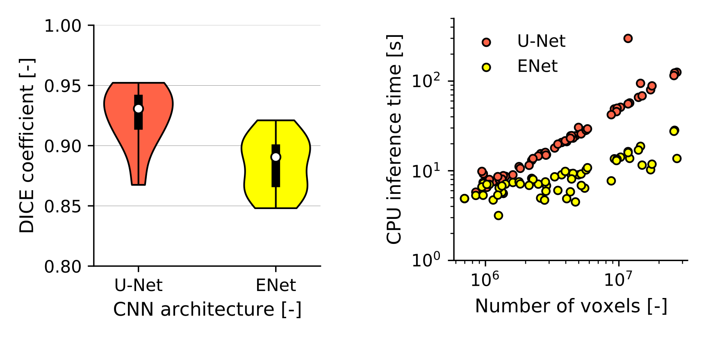

# Convolutional neural network toolkit for segmenting airways and lungs

## Overview
This project aimed to train a machine learning algorithm capable of producing airway and lung segmentations from chest CT scans. 

This repository contains pre-trained pytorch CNNs that can be used to segment airways from chest CT scans. We also provide our training scripts that can be used to retrain the CNN models. We trained two CNN architectures on data from the LUNA16. We trained a U-Net which can provide higher accuracy segmentations but with high memory requirements and larger inference time. We also trained an ENet model, which has fewer parameters and allows for faster and less memory-intensive segmentation. This comes at the cost of slightly lower accuracy. A comparison between performance is given below for accuracy (DICE coefficient) and inference time.



We also provide a script to segment the lung lobes using the 2D U-Net from [Hofmanninger et al. (2020)](https://github.com/JoHof/lungmask). This can be used to crop the CT scan to the lung bounding box, which improves computational efficiency.

## Getting Started
First, install the required dependencies (best practice is to use a virtual environment)
```bash
conda create --name pycnn python=3.10
conda activate pycnn
pip install hjson numpy pandas torch torchio SimpleITK sklearn vedo lungmask
```

### Retraining
To retrain a CNN on some data you have available, add the paths to the images and labels as entries in a tabular file (`cnn_training_cases.txt`) formatted like so:
```
/path/to/image1 /path/to/label1
/path/to/image2 /path/to/label2
```
These will then be split into train and validation sets (which are saved as `train_cases.txt` and `val_cases.txt`). Also you can edit any hyperparameters defined in `trainconfig.json` and run
```bash
python3 train.py
```

### Using a CNN to segment an image
To lower the memory consumption and inference time for segmenting the airways, we can first segment the lobes and use this as a bounding box for cropping the image
```bash
python segment_lunglobes.py -i /path/to/ct/scan.mhd -id example
```
The airways can then be segmented by 
```bash
python segment.py -i /path/to/ct/scan.mhd -o example.stl
```
which will create three files in the current directory (`example.mhd`, `example.zraw` and `example.stl`).

## Get Help
Please submit an issue to the issues panel on this repository.

## Citing this repository
If you use the code or models in this repository, please cite our paper
```
@article{TODO}
```

Also, if you use the `segment_lunglobes.py` script, make sure to read and cite the following great paper:
```
@article{hofmanninger2020automatic,
  title={Automatic lung segmentation in routine imaging is primarily a data diversity problem, not a methodology problem},
  author={Hofmanninger, Johannes and Prayer, Forian and Pan, Jeanny and R{\"o}hrich, Sebastian and Prosch, Helmut and Langs, Georg},
  journal={European Radiology Experimental},
  volume={4},
  number={1},
  pages={1--13},
  year={2020},
  publisher={SpringerOpen}
}
```

## Acknowledgements
The model architecture scripts [`unet.py`](https://github.com/Thvnvtos/Lung_Segmentation/blob/unet3d/model.py) and [`enet.py`](https://github.com/davidtvs/PyTorch-ENet/blob/master/models/enet.py) were taken from other repositories (see links).
